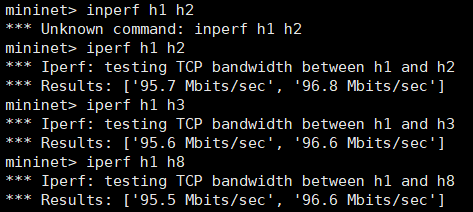

## Create Custom DC Topology
####  Establish Topology In Mininet
1.  Start Controller
    ```
    root@server03:~/ryu/ryu/app# ryu-manager simple_switch_stp_13.py
    ```
2. Establish Topology
    ```
    root@server03:~/mininet/custom# sudo mn --custom ./dc_topo.py --topo=mytopo --controller=remote
    ```
####  Establish Topology In Distrinet
1.  Start Controller
    ```
    root@server14:/home/sdn# ryu-manager /usr/lib/python3/dist-packages/ryu/app/simple_switch_stp_13.py --verbose
    ```
    
2. Establish Topology
    ```
    sdn@server13:~/Distrinet/mininet$ python3 bin/dmn --custom=/home/sdn/Distrinet/mininet/custom/dc_topo.py --bastion=172.16.50.34 --workers="172.16.50.34,172.16.50.35" --controller=lxcremote,ip=192.168.0.1 --topo=mytopo
    ```
     
## Simple Performance Test
#### Test In Mininet
1. Pingall Test
    
2. Topo Check
    
    
3. End to end bandwidth test
    
#### Test In Distrinet
1. Pingall Test
    
2. Topo Check
    
    
3. End to end bandwidth test
    
    Distrinet下的e2e带宽比默认mininet的带宽还要高
